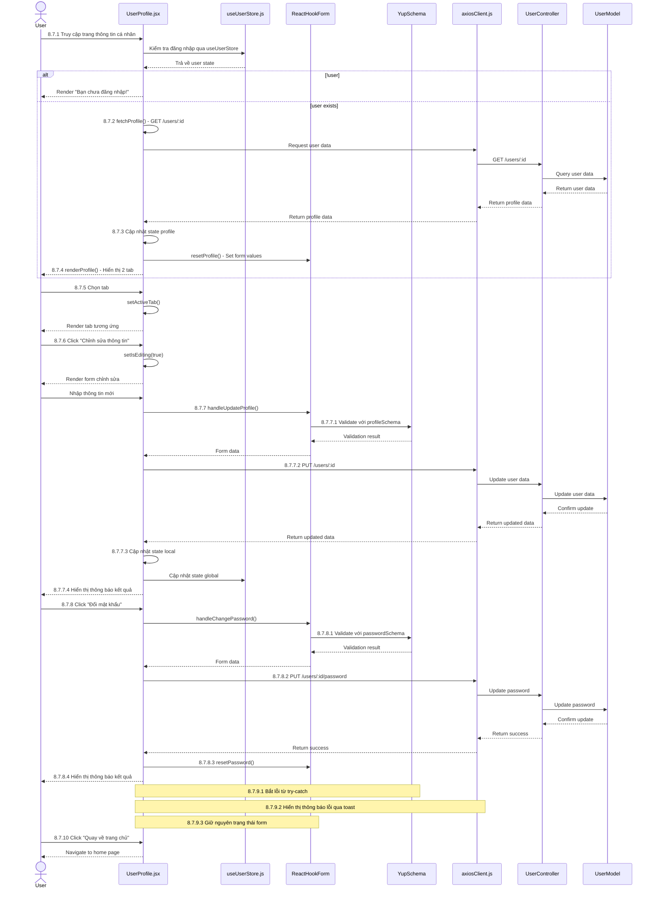

```mermaid
sequenceDiagram
    actor User
    participant UserProfile as UserProfile.jsx
    participant UserStore as useUserStore.js
    participant FormController as ReactHookForm
    participant Validation as YupSchema
    participant AxiosClient as axiosClient.js
    participant Server as UserController
    participant DB as UserModel

    %% Initial Load and Authentication Check
    User->>UserProfile: 8.7.1 Truy cập trang thông tin cá nhân
    UserProfile->>UserStore: Kiểm tra đăng nhập qua useUserStore
    UserStore-->>UserProfile: Trả về user state
    alt !user
        UserProfile-->>User: Render "Bạn chưa đăng nhập!"
    else user exists
        UserProfile->>UserProfile: 8.7.2 fetchProfile() - GET /users/:id
        UserProfile->>AxiosClient: Request user data
        AxiosClient->>Server: GET /users/:id
        Server->>DB: Query user data
        DB-->>Server: Return user data
        Server-->>AxiosClient: Return profile data
        AxiosClient-->>UserProfile: Return profile data
        UserProfile->>UserProfile: 8.7.3 Cập nhật state profile
        UserProfile->>FormController: resetProfile() - Set form values
        UserProfile-->>User: 8.7.4 renderProfile() - Hiển thị 2 tab
    end

    %% Tab Selection
    User->>UserProfile: 8.7.5 Chọn tab
    UserProfile->>UserProfile: setActiveTab()
    UserProfile-->>User: Render tab tương ứng

    %% Profile Update Flow
    User->>UserProfile: 8.7.6 Click "Chỉnh sửa thông tin"
    UserProfile->>UserProfile: setIsEditing(true)
    UserProfile-->>User: Render form chỉnh sửa
    User->>UserProfile: Nhập thông tin mới
    UserProfile->>FormController: 8.7.7 handleUpdateProfile()
    FormController->>Validation: 8.7.7.1 Validate với profileSchema
    Validation-->>FormController: Validation result
    FormController-->>UserProfile: Form data
    UserProfile->>AxiosClient: 8.7.7.2 PUT /users/:id
    AxiosClient->>Server: Update user data
    Server->>DB: Update user data
    DB-->>Server: Confirm update
    Server-->>AxiosClient: Return updated data
    AxiosClient-->>UserProfile: Return updated data
    UserProfile->>UserProfile: 8.7.7.3 Cập nhật state local
    UserProfile->>UserStore: Cập nhật state global
    UserProfile-->>User: 8.7.7.4 Hiển thị thông báo kết quả

    %% Password Change Flow
    User->>UserProfile: 8.7.8 Click "Đổi mật khẩu"
    UserProfile->>FormController: handleChangePassword()
    FormController->>Validation: 8.7.8.1 Validate với passwordSchema
    Validation-->>FormController: Validation result
    FormController-->>UserProfile: Form data
    UserProfile->>AxiosClient: 8.7.8.2 PUT /users/:id/password
    AxiosClient->>Server: Update password
    Server->>DB: Update password
    DB-->>Server: Confirm update
    Server-->>AxiosClient: Return success
    AxiosClient-->>UserProfile: Return success
    UserProfile->>FormController: 8.7.8.3 resetPassword()
    UserProfile-->>User: 8.7.8.4 Hiển thị thông báo kết quả

    %% Error Handling
    Note over UserProfile,Validation: 8.7.9.1 Bắt lỗi từ try-catch
    Note over UserProfile,AxiosClient: 8.7.9.2 Hiển thị thông báo lỗi qua toast
    Note over UserProfile,FormController: 8.7.9.3 Giữ nguyên trạng thái form

    %% Return to Home
    User->>UserProfile: 8.7.10 Click "Quay về trang chủ"
    UserProfile-->>User: Navigate to home page
``` 